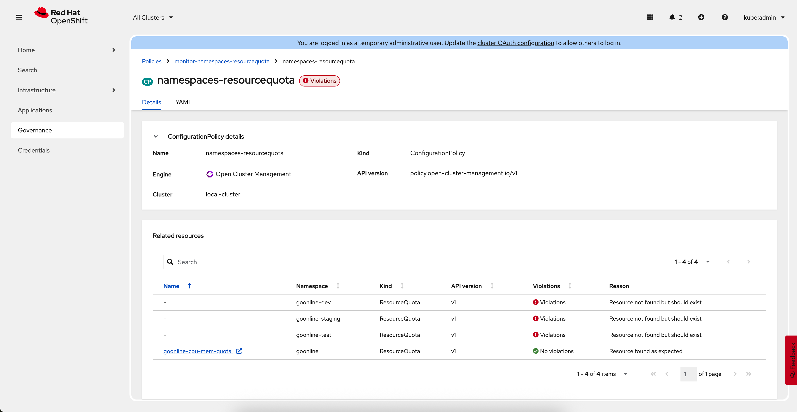

# Enforcing and monitoring resource limits on namespaces with Red Hat OpenShift Advance Management for Kubernetes

This repository demonstrates how to enforce and monitor resource limits on namespaces with Red Hat OpenShift Advance Management for Kubernetes using Policies defined.

## Overview

By default, OpenShift do not provide any limits for CPU, memory, number of pods running at the namespace (project) level untill configured. Anyway best practices prove that monitoring and resource management is important to provide resource management at the deployment level as well as at the namespace level. With this repo we will show you how to do that.

With Kubernetes ResourceQuota policy you can easily limit many important resources.
Commonly used resource types include:

```sh
  cpu: Total CPU cores across all pods in the namespace.
  memory: Total memory across all pods in the namespace.
  pods: Total number of pods in the namespace.
  services: Number of services.
  replicationcontrollers: Number of replication controllers.
  secrets: Number of secrets.
  configmaps: Number of configmaps.
  persistentvolumeclaims: Number of PVCs.
  requests.cpu: Total requested CPU across all pods.
  requests.memory: Total requested memory across all pods.
  limits.cpu: Total CPU limit across all pods.
  limits.memory: Total memory limit across all pods.
  services.loadbalancers: Number of LoadBalancer services.
  services.nodeports: Number of NodePort services.
  count/<resource>.<group>: Number of custom resources (e.g., count/jobs.batch).
```

 You can find the full list in the Kubernetes ResourceQuota documentation.
 https://kubernetes.io/docs/concepts/policy/resource-quotas/#resource-quota-per-resource-type

## Prerequisites

- Access to an OpenShift cluster with cluster-admin privileges.
- install Red Hat Advanced Cluster Management for Kubernetes operator
- configure Red Hat Advanced Cluster Management for Kubernetes at the local cluster
- `oc` or `kubectl` CLI tools installed and configured.

## Quick Start

### 1. Create example namespaces

Run a first script to create example namespaces:

```sh
./01-namespaces.sh
```


you should see them 4 like above.

### 2. Create example policies

Next, create two example policies named `enforce-goonline-resourcequota` and `monitor-namespaces-resourcequota`

```sh
./02-apply-policies.sh
```

check them at the RHACM console, `enforce-goonline-resourcequota` shoud not report violations and `monitor-namespaces-resourcequota` will report violations for 3 namespaces called `goonline-dev`, `goonline-staging` and `goonline-test`


inspecting details for `monitor-namespaces-resourcequota` policy will show you exhausive list of namespaces which are not compiant, meaning with no resource quota defined



### 3. Manually fix missing resource quotas for namespaces

run the last script to manually apply missing quotas for `goonline-dev`, `goonline-staging` and `goonline-test` namespaces

```sh
./02-apply-policies.sh
```
With above we satisfy `monitor-namespaces-resourcequota` policy and therefore it will not complain for violations anymore.


Supplied code is quite easy so you can easily make you modiffications and apply to your environment.

## Contributing

Contributions and suggestions are welcome! Please open an issue or submit a pull request.

## License

This repository is licensed under the MIT License.


